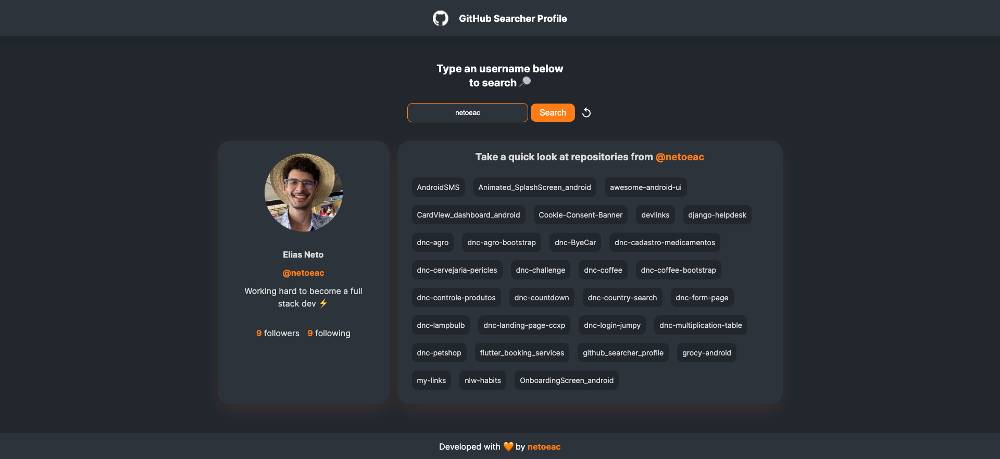

<h1 align="center"> GitHub Searcher Profile 🔎 </h1>
 

  

## 💻 About the project:

This project was developed as a way to study how to consume API's, for this project I have used the [official documentation](https://docs.github.com/pt/rest) from [GitHub](https://github.com) to develop a simple search profile and data.

## ⚡️ This project was developed using this following techs:
  <ul>
    <li> HTML & CSS</li>
    <li> JavaScript</li>
    <li> Git & GitHub</li>
    <li> Figma</li>
 </ul>
 

 Hope you enjoy as much as I have! ⭐

